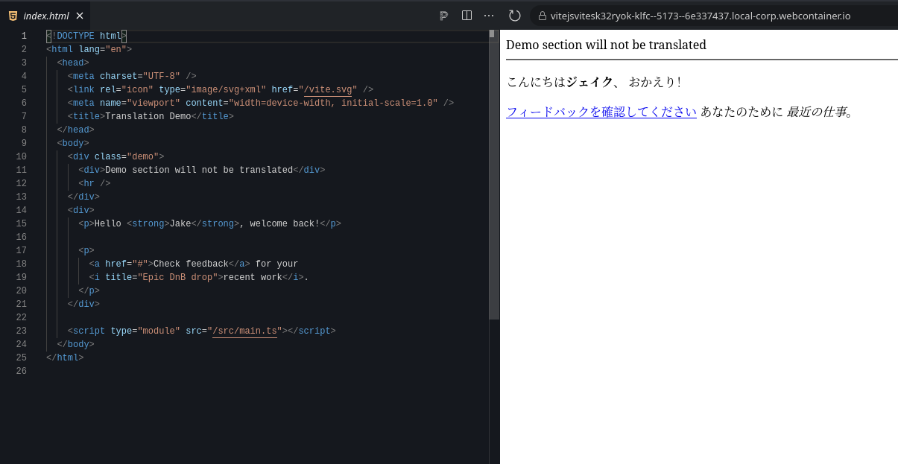

Simple and powerful DOM translator.

 [](https://www.npmjs.com/package/domtranslator)  [](https://github.com/translate-tools/domtranslator/graphs/contributors)


[](https://primebits.org)


# About

With this package you may implement translation for any elements on web page like "Google Translate Widget" and make site multi lingual even if no localization system is designed yet.

Some of key features
- Battle tested solution. This package is used by a popular browser extension [Linguist Translate](https://linguister.io/) with **over 200k active users**.
- DOM translator is a high performance solution
- Modular design let you tune any part DOM translator
- Translation of web pages with dynamical changes is supported
- Highly configurable design let you start translate any document in minutes

Screenshot of [Live Demo][demo-url]

[][demo-url]

# Usage

Install with `npm install domtranslator`

Check out [Live Demo][demo-url] to see a real world usage example with a real translator.

Simple example with dummy translator is

```js
import {
  PersistentDOMTranslator,
  DOMTranslator,
  NodesTranslator,
  IntersectionScheduler
} from 'domtranslator';

import { createNodesFilter } from 'domtranslator/utils/nodes';

// Dummy translator
const translator = async (text) => '[translated] ' + text;

// `PersistentDOMTranslator` will translate updated nodes with use `DOMTranslator`
const domTranslator = new PersistentDOMTranslator(
  new DOMTranslator(
    // Nodes will be translated with fake translator,
    // that is just adds a text prefix to original text
    new NodesTranslator(translator),
    {
      // When `scheduler` is provided, a lazy translation mode will be used.
      // Nodes will be translated only when intersects a viewport
      scheduler: new IntersectionScheduler(),

      // Filter will skip nodes that must not be translated
      filter: createNodesFilter({
        // Only listed attributes will be translated
        attributesList: [
          'title',
          'alt',
          'placeholder',
          'label',
          'aria-label',
        ],
        // Any elements not included in list will be translated
        ignoredSelectors: [
          'meta',
          'link',
          'script',
          'noscript',
          'style',
          'code',
          'textarea',
        ],
      }),
    }
  ),
);

// You may translate whole document
domTranslator.translate(document.documentElement);

// Or just few elements
// domTranslator.translate(document.querySelector('#widget1'));
// domTranslator.translate(document.querySelector('#widget2'));
// domTranslator.translate(document.querySelector('#widget3'));

// You may disable translation for any element, and restore its original text
domTranslator.restore(document.documentElement);

// Or for specific element
// domTranslator.restore(document.querySelector('#widget2'));
```

So if you would run this code against next HTML document
```html
<body>
  <div>
    <p>
      Hello <strong>Jake</strong>, welcome back!
    </p>

    <p>
      <a href="#">Check feedback</a> for your <i title="Epic DnB drop">recent work</i>.
    </p>
  </div>
</body>
```

Your result would be
```html
<body>
  <div>
    <p>
      [translated] Hello <strong>[translated] Jake</strong>[translated] , welcome back!
    </p>

    <p>
      <a href="#">[translated] Check feedback</a>[translated]  for your <i title="[translated] Epic DnB drop">[translated] recent work</i>.
    </p>
  </div>
</body>
```

# API

## NodesTranslator

The `NodesTranslator` class is purposed to translate text nodes.

To translate element with its nested text nodes and attributes, use `DOMTranslator`.

Usage example

```ts
import { NodesTranslator } from 'domtranslator';

const nodesTranslator = new NodesTranslator(translator);

const altAttr = document.querySelector('img').getAttribute('alt');
nodesTranslator.translate(altAttr);
```

In this example we get `Attr` node of image and translate it.

Below listed documentation for class methods.

### constructor(translator: (text: string, score: number) => Promise<string>)

Translator is a callback that will be called to translate node text.

Callback will be called when node is translates first time and when node is updated and must be translated again.

Arguments passed to a callback is
- `text` - a node text for translation
- `score` - a measured importance score of node, based on its position in document, its content and context. The greater number - the more important node. This is optional parameter to use, if you need to schedule translating based on node importance score.

### translate(node: Node, callback?: ProcessedNodeCallback): void

Method run node text translation.

If callback is provided, it will be called once node will be translated. Target node will be passed in arguments.

This method may be called only once for one node, otherwise throws error.

### update(node: Node, callback?: ProcessedNodeCallback): void

Method run translation for node text if node is already processed. Otherwise throws error.

Works equal to `translate` method.

### restore(node: Node): void

Method restores original node text

### has(node: Node): boolean

Method returns `boolean` that reflect translation state of node.

If returned `true` - it means node is translated.

### getState(node: Node): NodeTranslationState | null

If node is translated, this method returns node state, otherwise `null` will be returned.

The state includes original text of node if node translated or `null` in case node is in pending of translation.


```ts
export type NodeTranslationState = {
  originalText: string | null;
};
```

## DOMTranslator

The `DOMTranslator` class works equal to `NodesTranslator` but
- it recursive translates whole DOM tree passed to its methods
- can translate nodes lazy
- can filter nodes to skip those that should not be translated (like URLs or class names, etc)

### constructor(nodesTranslator: NodesTranslator, config: Config)

A `nodesTranslator` is an instance of `NodesTranslator`.

Config is described by next type

```ts
export type Config = {
  /**
   * If is provided, nodes can be translated delayed - after intersect the viewport
   */
  scheduler?: DOMTranslationScheduler;

  /**
   * Determines which nodes should be translated
   */
  filter?: (node: Node) => boolean;
};
```

When `scheduler` option is provided, translation will be run in lazy mode that depends on implementation of `DOMTranslationScheduler`.

You may provide instance of `IntersectionScheduler` to translate only nodes in browser viewport.
If node is out of viewport, it will be not translated automatically. Instead `IntersectionObserver` will start watch over node, and once it will intersect viewport, translation will be started.

When `filter` option is provided, it will be called for each node and in case callback will return `false`, node will be not translated.

Keep in mind that `filter` will be called for every `Node`, not `Element`. If you have only 1 element on page with 5 attributes and text inside, callback will be called 6 times for every of mentioned nodes.

You may use `createNodesFilter` util as shown in example above, to configure callback to filter out nodes.

```
import { createNodesFilter } from 'domtranslator/utils/nodes';
```

Or, you may implement this logic yourself.

## PersistentDOMTranslator

Translates DOM tree persistently.

Unlike `DOMTranslator`, when nodes in tree is updates, it will be automatically translated.

This feature is implemented with `MutationObserver` and protected against recursion when translated node trigger update, that translate node and trigger update.


### constructor(readonly translator: IDomTranslator)

Constructor expects instance of `DOMTranslator` or another object that implement its interface.


# Support us

[](https://github.com/translate-tools/domtranslator)

This project follows a [FOSS principles](https://en.wikipedia.org/wiki/Free_and_open-source_software). If you like this package spread the word about it.

Star repo on GitHub, share it on social media.

You also may support a project with your contributions. Create issue or pull request in our repo.


[demo-url]: https://stackblitz.com/edit/vitejs-vite-sk32ryok?file=index.html